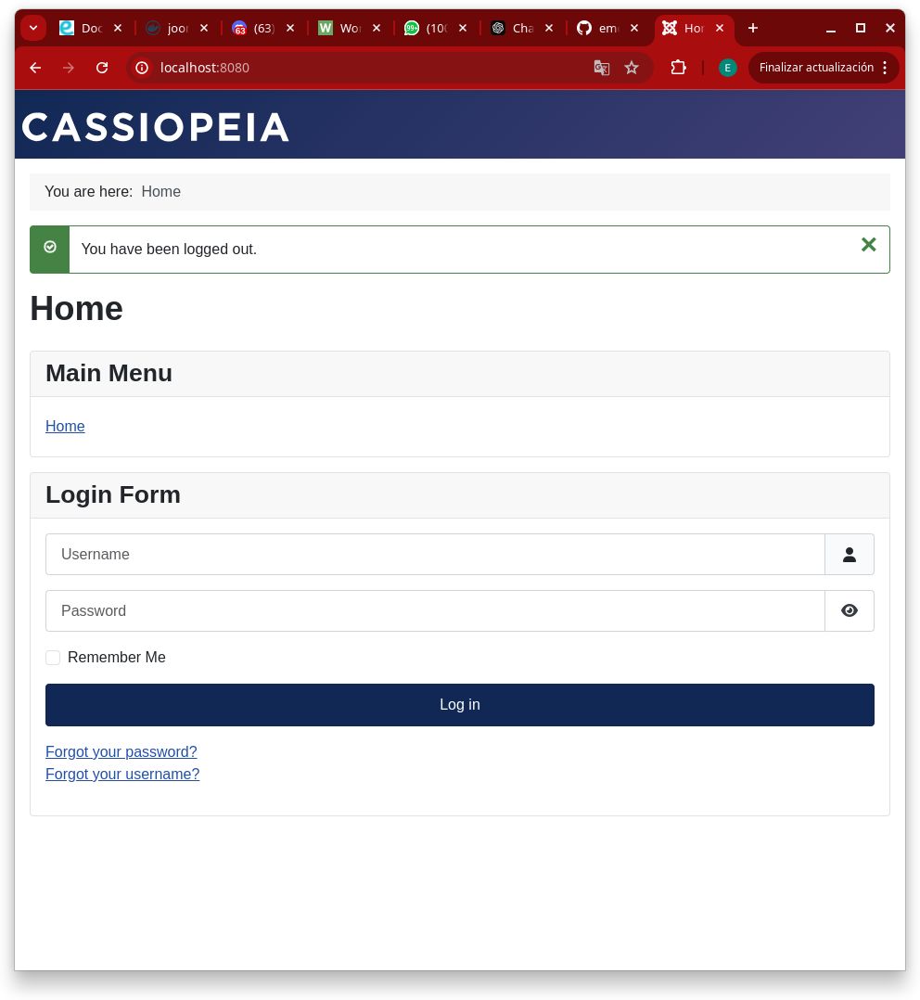
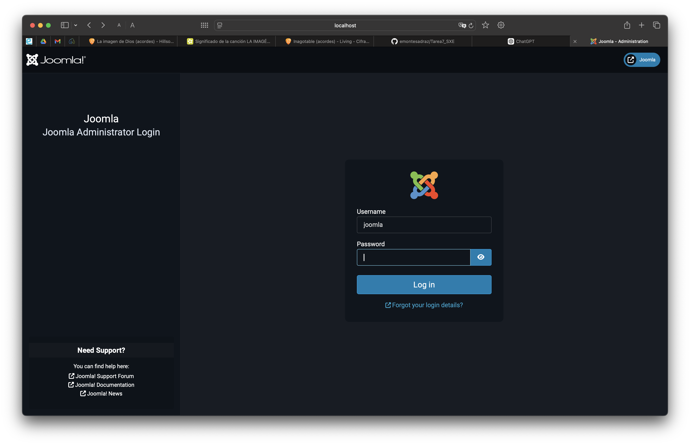
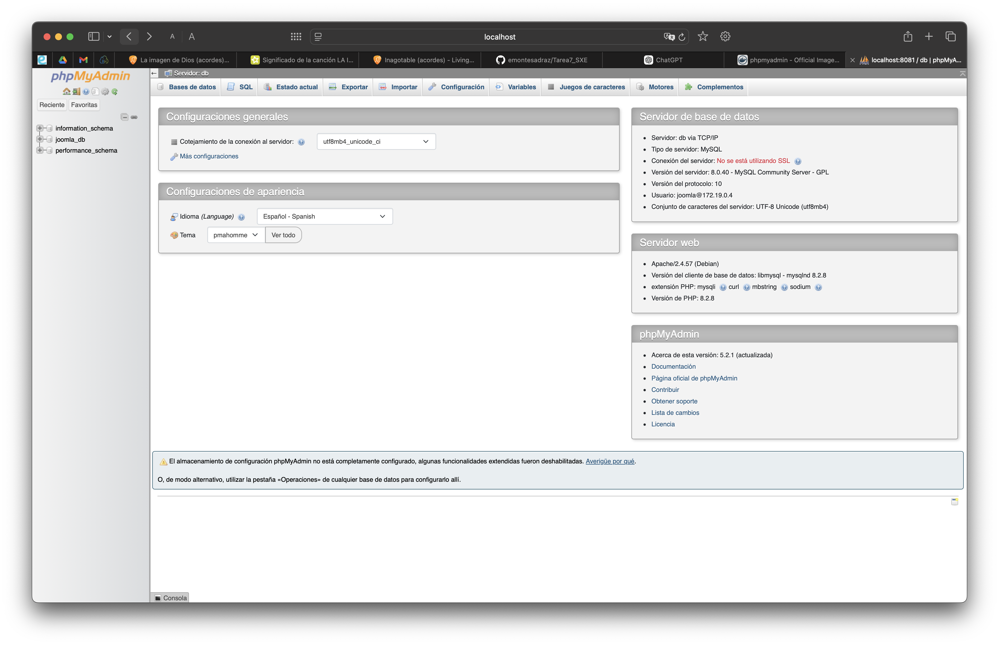

# Tarea 7 
*Esteban Miguel Montes Adraz* - *2 DAM* - *SXE*

--- 

## Parte 1: Instalar Joomla  con docker-compose

1. Para empezar, crearemos una carpeta llamada ```Joomla``` para tenerlo todo más organizado

```bash
mkdir joomla

cd joomla
```
2. Creamos un fichero llamado ```docker-compose.yml```

```bash
nano docker-compose.yml
```
3. Introducimos lo siguiente en el docker-compose
```yml
services:

  joomla:
    image: joomla
    restart: always
    ports:
      - 8080:80
    environment:
      JOOMLA_DB_HOST: db
      JOOMLA_DB_USER: joomla
      JOOMLA_DB_PASSWORD: examplepass
      JOOMLA_DB_NAME: joomla_db
      JOOMLA_SITE_NAME: Joomla
      JOOMLA_ADMIN_USER: Joomla Hero
      JOOMLA_ADMIN_USERNAME: joomla
      JOOMLA_ADMIN_PASSWORD: joomla@secured
      JOOMLA_ADMIN_EMAIL: joomla@example.com
    volumes:
      - joomla_data:/var/www/html
    networks:
      - joomla_network

  db:
    image: mysql:8.0
    restart: always
    environment:
      MYSQL_DATABASE: joomla_db
      MYSQL_USER: joomla
      MYSQL_PASSWORD: examplepass
      MYSQL_RANDOM_ROOT_PASSWORD: '1'
    volumes:
      - db_data:/var/lib/mysql
    networks:
      - joomla_network

volumes:
  joomla_data:
  db_data:

networks:
  joomla_network:

```
4. Ahora lo ejecutamos
```bash
docker-compose up -d
```
5. Nos qeudaría algo así


6. Vemos si se ha instalado todo correctamente y luego comprobamos que podemos acceder por nuestro navegador
```bash
docker ps -a
```

7. Accedemos al navegador y ponemos en la barra de búsqueda ```http://localhost:8080```. A continuación vamos a ver lo que nos irá apareciendo
    * Entraremos a la pantalla de login y podremos el usuario y la contraseña que pusimos en Admin en el docker compose, más exactamente esto
    ```yml
    JOOMLA_ADMIN_USERNAME: joomla

    JOOMLA_ADMIN_PASSWORD: joomla@secured
    ``` 
    Nos saldrá algo como esto
    

  Con esto entraríamos al front-end de joomla, pero si queremos acceder al back-end, debemos poner esto en nuestro navegador
  ```http://localhost:8080/administrator```

  * Luego nos saldrá esta página de inicio de sesión donde pondremos el nombre de usuario y la contraseña de admin

  

  * Después de rellenar los datos entraremos a esta página de aquí
  

## Parte 2: Añadir PHPMyAdmin al docker compose

1. Para añadir phpmyadmin al docker compose tendremos que editar el archivo para que se pueda instalar

```bash
nano docker-compose.yml
```
2. Añadimos esto al final del docker compose
```yml
phpmyadmin:
    image: phpmyadmin
    restart: always
    ports:
      - 8081:80
    environment:
      - PMA_ARBITRARY=1
```

Quedando algo así en total
```yml
services:

  joomla:
    image: joomla
    restart: always
    ports:
      - 8080:80
    environment:
      JOOMLA_DB_HOST: db
      JOOMLA_DB_USER: joomla
      JOOMLA_DB_PASSWORD: examplepass
      JOOMLA_DB_NAME: joomla_db
      JOOMLA_SITE_NAME: Joomla
      JOOMLA_ADMIN_USER: Joomla Hero
      JOOMLA_ADMIN_USERNAME: joomla
      JOOMLA_ADMIN_PASSWORD: joomla@secured
      JOOMLA_ADMIN_EMAIL: joomla@example.com
    volumes:
      - joomla_data:/var/www/html
    networks:
      - joomla_network

  db:
    image: mysql:8.0
    restart: always
    environment:
      MYSQL_DATABASE: joomla_db
      MYSQL_USER: joomla
      MYSQL_PASSWORD: examplepass
      MYSQL_RANDOM_ROOT_PASSWORD: '1'
    volumes:
      - db_data:/var/lib/mysql
    networks:
      - joomla_network
  
  phpmyadmin:
    image: phpmyadmin/phpmyadmin
    restart: always
    ports:
      - 8081:80  # Exponemos phpMyAdmin en el puerto 8081
    environment:
      PMA_HOST: db  # Nombre del servicio de base de datos en Docker Compose
      PMA_USER: joomla
      PMA_PASSWORD: examplepass
    depends_on:
      - db
    networks:
      - joomla_network

volumes:
  joomla_data:
  db_data:

networks:
  joomla_network:
```

3. Ejecutamos el archivo con ```docker compose up -d``` y buscaremos en nuestro navegador ```http://localhost:8081```
Nos encontraremos con esto



Y ya tendríamos PHPMyAdmin instalado y funcionando junto a nuestra base de datos de Joomla